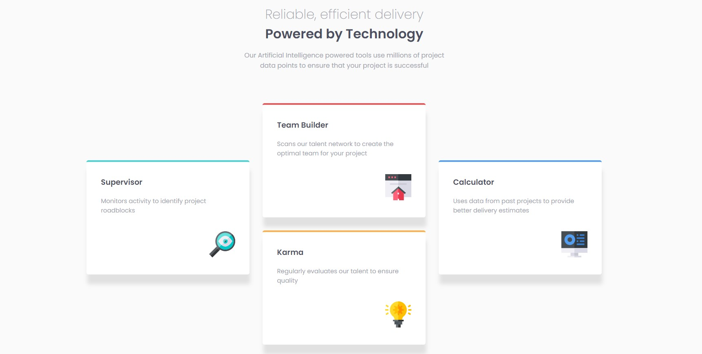

# Frontend Mentor - Four card feature section solution

This is a solution to the [Four card feature section challenge on Frontend Mentor](https://www.frontendmentor.io/challenges/four-card-feature-section-weK1eFYK). Frontend Mentor challenges help you improve your coding skills by building realistic projects. 

## Table of contents

- [Overview](#overview)
  - [The challenge](#the-challenge)
  - [Screenshot](#screenshot)
  - [Links](#links)
- [My process](#my-process)
  - [Built with](#built-with)
  - [What I learned](#what-i-learned)
  - [Continued development](#continued-development)
  
- [Author](#author)


**Note: Delete this note and update the table of contents based on what sections you keep.**

## Overview

### The challenge

Users should be able to:

- View the optimal layout for the site depending on their device's screen size

### Screenshot




### Links

- Solution URL: [Add solution URL here](https://your-solution-url.com)
- Live Site URL: [Add live site URL here](https://your-live-site-url.com)

## My process

### Built with

- SCSS
- Flexbox


### What I learned

- Responsive design
- CSS Flexbox 


Some CSS code I'm proud of

```css
body .container {
    margin: 0 auto 80px;
    display: -webkit-box;
    display: -ms-flexbox;
    display: flex;
    -webkit-box-pack: center;
        -ms-flex-pack: center;
            justify-content: center;
    -ms-flex-wrap: wrap;
        flex-wrap: wrap;
    padding: 0; }

body .container .supervisor {
    border-top: 4px solid #45d3d3;
    -webkit-transform: translateY(50%);
    transform: translateY(50%); }    
```


### Continued development

I want to continue focusing on: CSS Flex, Grid, mobile first approach, atomic CSS and BEM in future projects. These are concepts i am still not completely comfortable with or techniques i found useful that i want to refine and perfect.


## Author

- Linkedin - [Ramil Novruzov](https://www.linkedin.com/in/ramilnovruzov/)
- Frontend Mentor - [@ramikoff](https://www.frontendmentor.io/profile/ramikoff)


